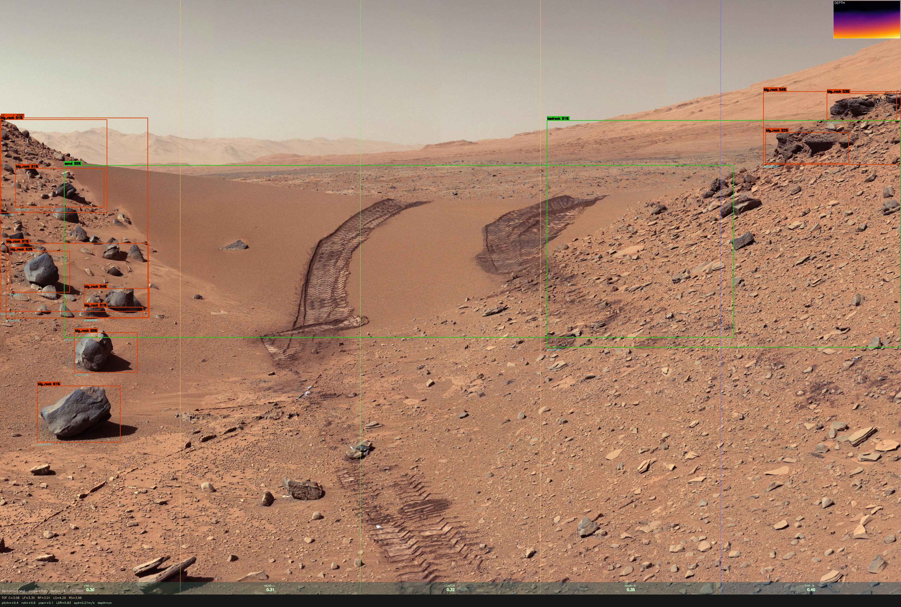
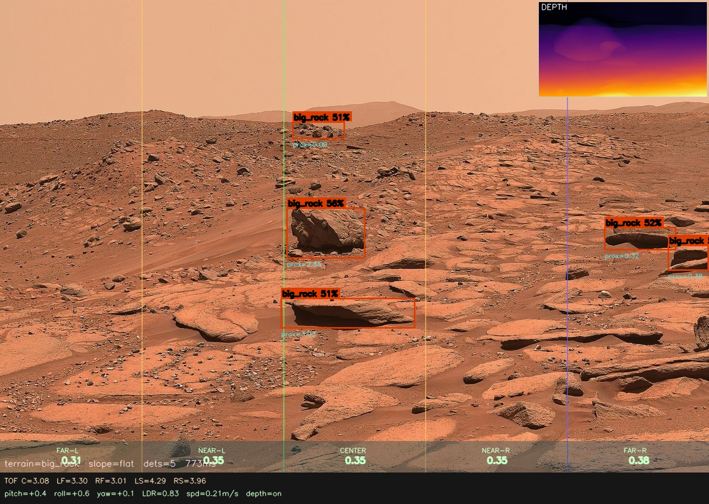
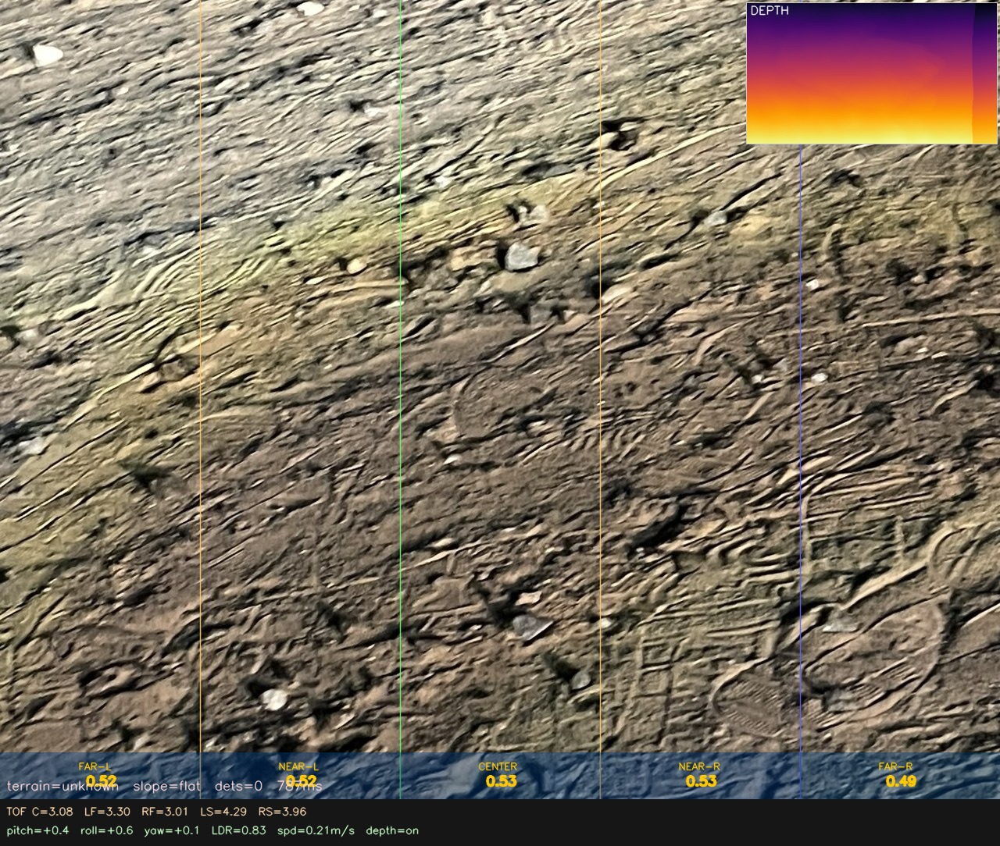
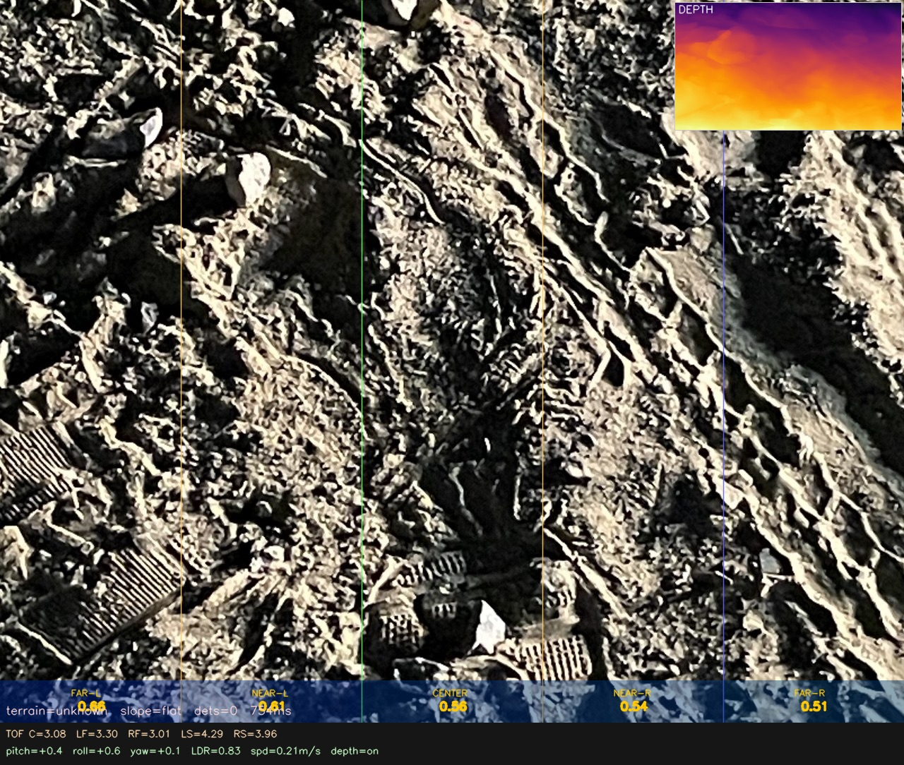
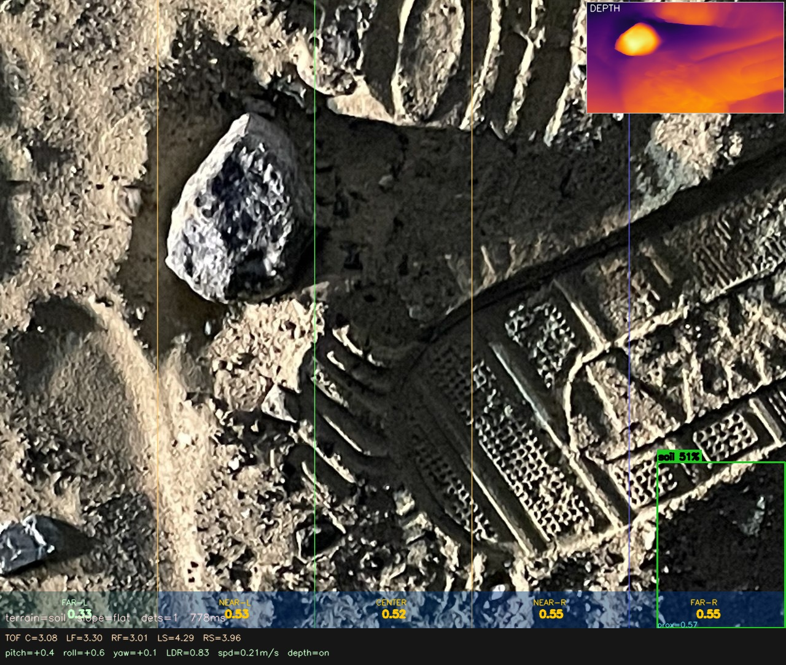
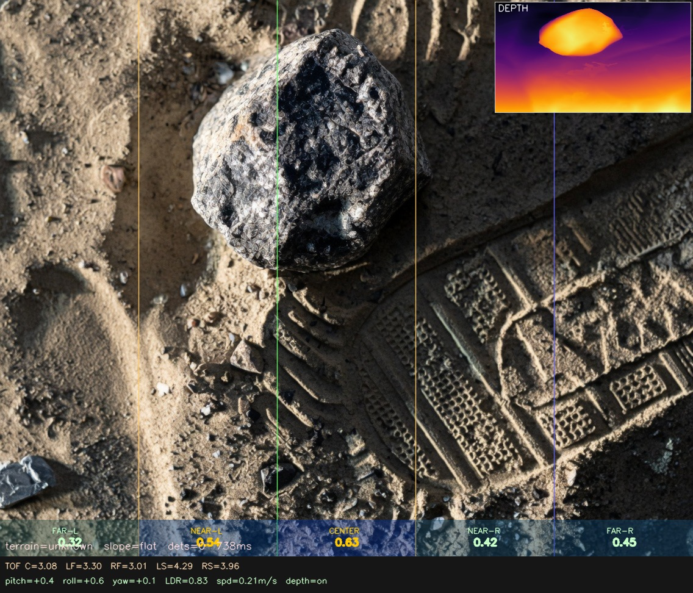

# MIRA — Mars Intelligent Rover Autonomy

<p align="center">
  
</p>

<p align="center">
  <a href="https://github.com/amxr21/MIRA/releases/tag/v1.0"></a>
  
  
  
  
  
</p>

<p align="center">
A real-time autonomous vision and navigation pipeline for a Mars rover.<br>
Runs custom YOLO (Mars terrain) + DepthAnything V2 on a <strong>Hailo-8L NPU</strong> with full sensor fusion via an <strong>Arduino Mega</strong>.
</p>

---

## Demo

### Pipeline Output Video

https://github.com/amxr21/MIRA/releases/download/v1.0/fusion_output.avi

> Recorded at ~13 FPS (both models on Hailo NPU). Frame layout: live camera feed with bounding boxes and velocity arrows (left) + depth map inset (top-right) + sensor strip with TOF / IMU / speed / navigation command (bottom).

---

## Results

Sample outputs from `tools/fuse_photos.py` — full fusion pipeline (YOLO + DepthAnything V2 + TOF sensor overlay) run on static Mars terrain images using ONNX CPU inference.

<p align="center">
  
  
</p>
<p align="center">
  
  
</p>
<p align="center">
  
  
</p>

**Bounding box colors:** red = `big_rock` (danger) · orange = `unknown_object` (caution) · green = terrain class (informational)
**Depth map** (top-right inset): Inferno colormap — bright = close, dark = far
**Bottom strip:** TOF distances (C / LF / RF / LS / RS) · IMU pitch/roll/yaw · LDR · speed · active NAV command

---

## Overview

```
Camera ──► YOLO (Mars)   ──►┐
           Depth (DA V2)  ──►│  Fusion ──► Navigation Decision ──► Arduino Motors
           COCO (unknown) ──►│
Arduino ─► TOF/IMU/LDR   ──►┘
```

MIRA fuses data from a camera, five time-of-flight sensors, an IMU, an LDR, and two ultrasonic bumpers to make navigation decisions in real time. The vision pipeline runs on a Hailo-8L NPU with automatic fallback to ONNX CPU inference when the NPU is unavailable.

---

## Hardware

| Component | Part | Role |
|---|---|---|
| **SBC** | Raspberry Pi (5 recommended) | Runs the Python pipeline |
| **NPU** | Hailo-8L M.2 | Accelerates YOLO + Depth inference |
| **Microcontroller** | Arduino Mega 2560 | Sensor reads + motor commands |
| **Camera** | USB / CSI camera | 1280×720 @ 30 FPS input |
| **TOF ×5** | VL53L1X | Proximity: center-front, left-front, right-front, left-side, right-side |
| **IMU** | MPU-6050 | Pitch, roll, yaw |
| **Ultrasonic ×2** | HC-SR04 | Front + rear bumper fallback |
| **LDR** | Photoresistor on A0 | Ambient light → depth model trust weight |
| **Motors** | DC motors via L298N | Differential drive |

### Arduino Pin Map

| Signal | Pin |
|---|---|
| TOF XSHUT 0–4 | D38–D42 |
| TOF I²C | SDA/SCL |
| Ultrasonic Front TRIG/ECHO | D24/D25 |
| Ultrasonic Rear TRIG/ECHO | D29/D28 |
| IMU (MPU-6050) | SDA/SCL |
| LDR | A0 |
| Motor ENA/ENB (PWM) | D3/D9 |
| Motor IN1–IN4 | D5/D6/D7/D8 |

---

## Project Structure

```
mira/
├── pipeline/
│   ├── pipeline.py          # Single-file pipeline (Windows dev + Pi run) — primary entry point
│   ├── pipeline_pi.py       # Clean Pi-only version (no WINDOWS_MODE shims) — copy to Pi
│   ├── main.py              # Modular entry point — wires all modules below
│   ├── config.py            # All flags and CONFIG dict — edit here only
│   ├── structures.py        # Shared dataclasses (Detection, SensorReading, FusionResult, NavigationCommand)
│   ├── models.py            # YOLO + Depth model classes (Hailo & ONNX) + COCO unknown tagging
│   ├── sensors.py           # Arduino serial interface + dummy fallback
│   ├── fusion.py            # TOF/depth/LDR fusion logic
│   ├── decision.py          # Motion tracking + 10-priority navigation waterfall
│   └── recorder.py          # Annotated AVI output (3-region canvas)
│
├── tools/
│   └── fuse_photos.py       # Batch-process sample images through the pipeline
│
├── arduino/
│   └── arduino_mira/
│       └── arduino_mira.ino # Main firmware — flash this to the Arduino Mega
│
├── models/
│   ├── depthAnything/
│   │   ├── depth_anything_v2_vits.hef        # Hailo NPU model (primary)
│   │   └── depth_anything_v2_small.onnx      # CPU fallback
│   └── yolo26/
│       ├── yolo26n_mars.hef                  # Hailo NPU model (primary)
│       ├── yolo26n_mars.onnx                 # CPU fallback
│       └── yolo26n-seg.onnx                  # COCO model (unknown object tagging, CPU)
│
├── tests/
│   ├── arduino/
│   │   ├── test_motors/                      # Motor-only test sketch
│   │   ├── test_sensors/                     # Sensor-only test sketch
│   │   └── test_sensor_motor_fusion/         # Combined sensor+motor test sketch
│   └── python/
│       ├── test_hailo_both.py                # Both models on Hailo NPU
│       ├── test_hailo_depth_cpu_yolo.py      # YOLO on CPU, Depth on Hailo
│       └── test_sensors.py                   # Arduino sensor reading test
│
├── samples/
│   ├── input/                                # Source images (mars_01–11.jpg, photo_01–07.jpg)
│   └── output/                               # Fusion results — embedded in this README
│
├── streaming/
│   └── dashboard.py                          # Flask web dashboard — future feature, not tested
│
├── logs/                                     # Runtime AVI output (git-ignored)
├── .gitignore
├── requirements.txt
└── README.md
```

---

## Software Stack

### Python Libraries

| Library | Version | Purpose |
|---|---|---|
| `opencv-python` | ≥ 4.8 | Camera capture, frame annotation, video writing |
| `numpy` | ≥ 1.24 | Array ops, depth map math, NMS |
| `onnxruntime` | ≥ 1.16 | CPU inference for YOLO + Depth when Hailo unavailable |
| `pyserial` | ≥ 3.5 | Arduino ↔ Raspberry Pi serial communication |
| `pynput` | ≥ 1.7 | Non-blocking keyboard input for manual drive mode |
| `flask` | ≥ 3.0 | Web dashboard server *(streaming/, future)* |
| `flask-socketio` | ≥ 5.3 | Live video/sensor streaming *(future)* |
| `hailo_platform` | Pi only | Hailo-8L NPU SDK — install separately |

### Arduino Libraries

| Library | Purpose |
|---|---|
| `VL53L1X` (Pololu) | Time-of-flight sensor driver |
| `MPU6050_light` | IMU pitch/roll/yaw |
| `Wire` | I²C bus |

### Models

| Model | Format | Backend | Input | Purpose |
|---|---|---|---|---|
| `yolo26n_mars.hef` | Hailo HEF | Hailo-8L NPU | 416×416 | Mars terrain detection (soil, bedrock, sand, big_rock) |
| `yolo26n_mars.onnx` | ONNX | CPU | 640×640 | Same — CPU fallback |
| `depth_anything_v2_vits.hef` | Hailo HEF | Hailo-8L NPU | 224×224 | Monocular depth / proximity map |
| `depth_anything_v2_small.onnx` | ONNX | CPU | 224×224 | Same — CPU fallback |
| `yolo26n-seg.onnx` | ONNX | CPU | 640×640 | COCO 80-class detection — unknown object tagging |

---

## Setup

### 1. Flash Arduino firmware

Open `arduino/arduino_mira/arduino_mira.ino` in the Arduino IDE and flash to the **Arduino Mega 2560**. Required libraries (install via Library Manager):
- `VL53L1X` by Pololu
- `MPU6050_light` by rfetick

### 2. Install Python dependencies

```bash
pip install -r requirements.txt
```

For the Hailo SDK, follow the [HailoRT installation guide](https://github.com/hailo-ai/hailort) for your Raspberry Pi OS version.

### 3. Configure `pipeline/config.py`

```python
ARDUINO_ENABLED = 1   # 0 = dummy sensor readings, 1 = real Arduino on serial
RECORD_ENABLED  = 1   # 0 = display only,          1 = write AVI to logs/
COCO_ENABLED    = 1   # 0 = Mars model only,        1 = also tag unknown objects
MOTORS_ENABLED  = 0   # 0 = manual keyboard drive,  1 = autonomous pipeline control
```

Also check:
```python
CONFIG["camera_index"] = 0    # USB camera index
```

---

## Running

### On Raspberry Pi (production)

```bash
cd mira/
python3 pipeline/pipeline_pi.py
```

Or the modular version:

```bash
python3 pipeline/main.py
```

### On Windows (development / testing with a video file)

Set `WINDOWS_MODE = 1` in `pipeline/pipeline.py` (default). Set `VIDEO_SOURCE` to a file or `0` for live camera:

```python
WINDOWS_MODE = 1
VIDEO_SOURCE = "samples/input/sample.mp4"   # or VIDEO_SOURCE = 0
```

```bash
python pipeline/pipeline.py
```

### Generate sample outputs from images

```bash
python tools/fuse_photos.py
```

Reads all `.jpg` files from `samples/input/`, runs the full fusion pipeline on CPU (ONNX), writes annotated results to `samples/output/`.

---

## Manual Drive Controls

When `MOTORS_ENABLED = 0` (default):

| Key | Action |
|---|---|
| `W` / `↑` | FORWARD |
| `A` / `←` | TURN LEFT |
| `D` / `→` | TURN RIGHT |
| `Q` | SLOW |
| `S` / `↓` / `Space` | STOP |
| `Ctrl+C` | Quit |

---

## Pipeline Architecture

### Thread Model

```
┌─────────────────────────────────────────────────────────┐
│  Fast loop  (~30 Hz, daemon thread)                     │
│  Arduino.update() → decide() → NavigationCommand        │
├─────────────────────────────────────────────────────────┤
│  Slow loop  (8–20 FPS Hailo / 1–2 FPS CPU, daemon)      │
│  Camera → YOLO → Depth → COCO → fuse() →               │
│  estimate_motion() → display + record                   │
├─────────────────────────────────────────────────────────┤
│  Main loop  (50ms tick, main thread)                    │
│  AUTO: send NavigationCommand to Arduino                 │
│  MANUAL: keyboard → send command to Arduino             │
└─────────────────────────────────────────────────────────┘
```

### Navigation Decision Waterfall (priority order)

| Priority | Condition | Action |
|---|---|---|
| 1 | Ultrasonic bumper contact *(TOF failed)* | STOP |
| 2 | Dangerous tilt (pitch > 20° or roll > 25°) | STOP |
| 3 | Side TOF threat (< 0.8m) | TURN away |
| 4 | Front obstacle (< 0.5m) or rock/unknown object close | STOP |
| 5 | Object approaching (velocity < −0.5 m/s) | TURN away |
| 6 | Slope detected + TOF confirm | STOP / SLOW |
| 7 | Moderate tilt (pitch > 10° or roll > 15°) | SLOW |
| 8 | Low light (LDR < 0.25) | SLOW |
| 9 | Medium range obstacle (< 1.5m) | SLOW |
| 10 | All clear | FORWARD |

### Depth Fusion

The depth map from DepthAnything V2 is validated and corrected against the three front-facing TOF sensors at each frame:

| TOF vs Depth disagreement | Correction |
|---|---|
| ≤ 0.3 m | Blend using LDR weights — confidence 0.95 |
| 0.3 – 1.0 m | Scale zone to TOF value — confidence 0.60 |
| > 1.0 m | Stamp zone flat at TOF value — confidence 0.30 |

Ambient light (LDR) controls the depth model trust weight:
- **Bright (LDR ≥ 0.6):** 70% depth model, 30% TOF
- **Dim (0.25–0.6):** 30% depth model, 70% TOF
- **Dark (LDR < 0.25):** 0% depth model, 100% TOF

### Serial Protocol (Arduino → Pi)

13 comma-separated values at 115200 baud, 30 Hz:

```
tof0,tof1,tof2,tof3,tof4,pitch,roll,yaw,ldr,ultra_front,ultra_rear,speed,tof_ok
```

Commands (Pi → Arduino): single ASCII byte — `F` FORWARD, `S` SLOW, `L` TURN_LEFT, `R` TURN_RIGHT, `X` STOP.

A 500 ms watchdog on the Arduino side forces STOP if no command is received.

### Recorded Video Layout

```
┌──────────────────────────────────────┬──────────────┐
│  Camera feed + bounding boxes        │  Depth map   │
│  + velocity arrows + mode badge      │  (Inferno)   │
│              1280 × 720              │   320 × 180  │
├──────────────────────────────────────┴──────────────┤
│  Row 1: TOF C / LF / RF / LS / RS values  [source]  │
│  Row 2: pitch / roll / yaw / LDR / speed  ► NAV CMD │
│                     1280 × 80                        │
└──────────────────────────────────────────────────────┘
Output: 1280 × 800 XVID AVI → logs/fusion_output.avi
```

---

## Inference Performance

| Scenario | YOLO | Depth | Slow-loop FPS |
|---|---|---|---|
| Both on Hailo NPU | HEF | HEF | ~13–20 FPS |
| One on Hailo, one on CPU | HEF | ONNX (or vice versa) | ~5–8 FPS |
| Both on CPU ONNX | ONNX | ONNX | ~1–2 FPS |

COCO unknown-object tagging runs on CPU alongside Mars on Hailo (separate silicon — no resource conflict). It is automatically disabled when YOLO falls back to CPU to avoid double CPU load.

---

## Environment Flags

All flags live in `pipeline/config.py`. Nothing else needs changing for a typical run.

| Flag | Values | Effect |
|---|---|---|
| `ARDUINO_ENABLED` | `0` / `1` | `0` uses dummy sensor readings (all-clear) |
| `RECORD_ENABLED` | `0` / `1` | `1` writes annotated AVI to `logs/` |
| `COCO_ENABLED` | `0` / `1` | `1` enables unknown object tagging via COCO model |
| `MOTORS_ENABLED` | `0` / `1` | `0` = keyboard, `1` = autonomous pipeline control |
| `WINDOWS_MODE` *(pipeline.py only)* | `0` / `1` | `1` disables `tty`/`termios` imports and enables `VIDEO_SOURCE` |
| `VIDEO_SOURCE` *(pipeline.py only)* | `0` or path | `0` = live camera, path = video file for testing |
| `HAILO_AVAILABLE` | auto-detected | Set by trying to import `hailo_platform` at boot |
